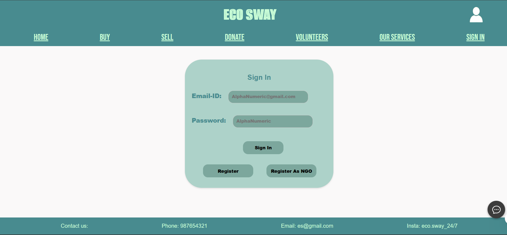
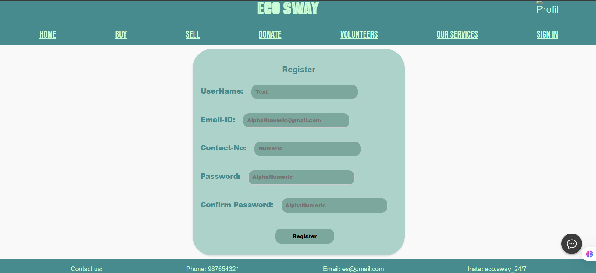
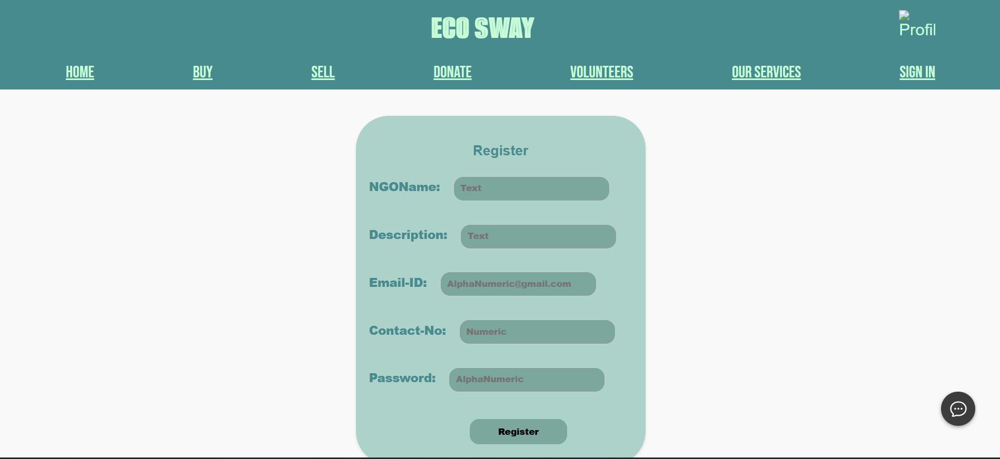

# 🌱 Environmental Awareness Web App

This is a full-stack web application built for an Environmental Studies (EVS) project. It enables users and NGOs to register, login securely, and raise awareness about environmental issues.

---

## 🚀 Features

- 👥 User and NGO Registration & Login
- 🔒 Secure Password Storage (bcrypt hashing)
- 📄 EJS-based Dynamic Pages
- 🧮 PostgreSQL Database Integration
- 📷 NGO Profile Picture Upload (via Multer)
- 🌍 Separate dashboards for NGOs and Users

---

## 📸 Screenshots

<!-- Add your actual screenshots in the `screenshots/` folder and update the paths -->

| Login Page | User Profile | NGO Signup |
|------------|--------------|------------|
|  |  |  |

---

## 🛠️ Tech Stack

- **Frontend**: HTML, CSS, EJS
- **Backend**: Node.js, Express.js
- **Database**: PostgreSQL
- **Security**: Bcrypt (password hashing), Cookies
- **File Upload**: Multer (for NGO profile image)

---

## ⚙️ How to Run Locally

```bash
git clone https://github.com/yourusername/evs-web-app.git
cd evs-web-app
npm install
