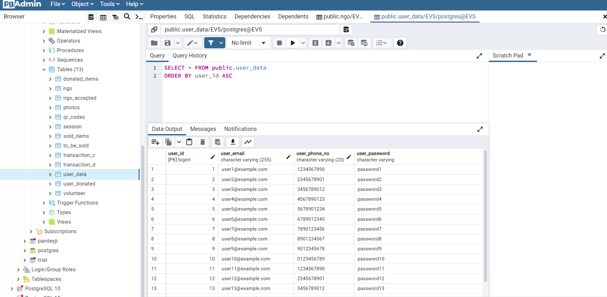

# 🌿 ECO SWAY - Environmental Studies Project

Welcome to **Eco Sway**, a web-based platform built to bridge the gap between **NGOs**, **individual users**, and **volunteers** for creating a sustainable environmental impact. The platform supports **donation**, **buy/sell of recyclable products**, **volunteer engagement**, and even has an **AI assistant** for environment-related queries.

---

## 🚀 Tech Stack

| Layer         | Technologies Used                            |
|---------------|-----------------------------------------------|
| 🌐 Frontend   | HTML, CSS, Bootstrap, EJS                     |
| 🧠 Backend    | Node.js, Express.js                           |
| 🗃 Database    | PostgreSQL                                    |
| 🔐 Security   | bcrypt for password encryption                |
| 🤖 AI Bot     | Botpress (for environment/weather queries)    |
| 🖼 Templating  | EJS (Embedded JavaScript Templates)           |
| 📦 Other      | Git, GitHub, dotenv, multer                   |

---

## 📌 Features

- 👥 User and NGO Registration/Login system
- 🔒 Secure Password Encryption (bcrypt)
- 🧾 Dashboard for NGOs and Users
- 🛒 Buy/Sell Portal for recyclable or donated items
- 🧍 Volunteer Management and Signups
- 🤖 AI Chatbot (ENV Bot) for environment and weather Q&A
- 📊 PostgreSQL-based structured database
- 📸 Screenshot documentation

---

## 📷 Screenshots
### 🗄 PostgreSQL Database Structure

The application is backed by a **PostgreSQL database** consisting of 13+ well-structured tables. These tables are designed to handle:

- 👤 `user_data`: Stores user details like name, email, phone, and hashed password.
- 🏢 `ngo`: Holds NGO-specific info including description, contact, and credentials.
- 📦 `to_be_sold`, `sold_items`, `donated_items`: Track items across various stages — from upload to transaction.
- 💰 `transaction_c`, `transaction_d`: Manage item transaction records (buy/sell or donation).
- 🧍 `volunteers`: Stores volunteer registration details.
- 🖼 `photos`: Stores image references of donated/sold items.
- 🧾 `qr_codes`: Stores QR details for verifying item authenticity.
- 🔐 `session`, `feedback`, etc.: Track user sessions, feedback, and extra features.

This schema ensures **data normalization**, reduces redundancy, and supports **clean API integration** between the backend and the frontend views.

### 🏠 Homepage

### 👤 User Registration

### 🏢 NGO Registration

### 🔐 Login Page

### 🛍️ Buy Page  

### 💸 Sell Page  

---

## 🤖 ENV AI Chatbot

An integrated Botpress-powered chatbot that:
- Answers environmental awareness questions
- Provides real-time weather updates
- Engages users in interactive environment-related discussions

